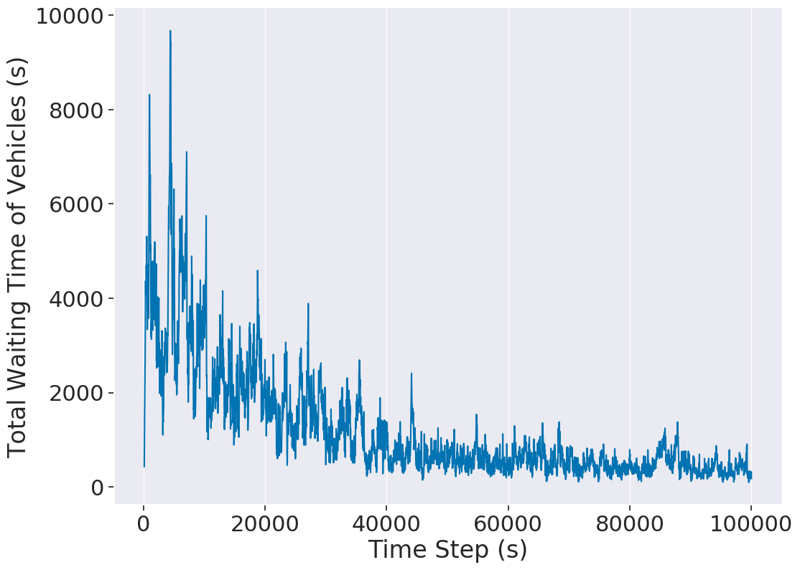

[](https://www.repostatus.org/#active)
[](https://github.com/LucasAlegre/sumo-rl/blob/master/LICENSE)


# SUMO-RL

SUMO-RL provides a simple interface to instantiate Reinforcement Learning environments with [SUMO](https://github.com/eclipse/sumo) for Traffic Signal Control. 

The main class [SumoEnvironment](https://github.com/LucasAlegre/sumo-rl/blob/master/sumo_rl/environment/env.py) behaves like a [MultiAgentEnv](https://github.com/ray-project/ray/blob/master/python/ray/rllib/env/multi_agent_env.py) from [RLlib](https://github.com/ray-project/ray/tree/master/python/ray/rllib).  
If instantiated with parameter 'single-agent=True', it behaves like a regular [Gym Env](https://github.com/openai/gym/blob/master/gym/core.py) from [OpenAI](https://github.com/openai).  
Call [env](https://github.com/LucasAlegre/sumo-rl/blob/master/sumo_rl/environment/env.py) or [parallel_env](https://github.com/LucasAlegre/sumo-rl/blob/master/sumo_rl/environment/env.py) for [PettingZoo](https://github.com/PettingZoo-Team/PettingZoo) environment support.  
[TrafficSignal](https://github.com/LucasAlegre/sumo-rl/blob/master/sumo_rl/environment/traffic_signal.py) is responsible for retrieving information and actuating on traffic lights using [TraCI](https://sumo.dlr.de/wiki/TraCI) API.

Goals of this repository:
- Provide a simple interface to work with Reinforcement Learning for Traffic Signal Control using SUMO
- Support Multiagent RL
- Compatibility with gym.Env and popular RL libraries such as [stable-baselines3](https://github.com/DLR-RM/stable-baselines3) and [RLlib](https://docs.ray.io/en/master/rllib.html)
- Easy customisation: state and reward definitions are easily modifiable

## Install

### Install SUMO latest version:

```
sudo add-apt-repository ppa:sumo/stable
sudo apt-get update
sudo apt-get install sumo sumo-tools sumo-doc 
```
Don't forget to set SUMO_HOME variable (default sumo installation path is /usr/share/sumo)
```
echo 'export SUMO_HOME="/usr/share/sumo"' >> ~/.bashrc
source ~/.bashrc
```
Important: for a huge performance boost (~8x) with Libsumo, you can declare the variable:
```
export LIBSUMO_AS_TRACI=1
```
Notice that you will not be able to run with sumo-gui or with multiple simulations in parallel if this is active ([more details](https://sumo.dlr.de/docs/Libsumo.html)).

### Install SUMO-RL

Stable release version is available through pip
```
pip install sumo-rl
```

Alternatively you can install using the latest (unreleased) version
```
git clone https://github.com/LucasAlegre/sumo-rl
cd sumo-rl
pip install -e .
```

## MDP - Observations, Actions and Rewards

### Observation
The default observation for each traffic signal agent is a vector:
```
    obs = [phase_one_hot, min_green, lane_1_density,...,lane_n_density, lane_1_queue,...,lane_n_queue]
```
- ```phase_one_hot``` is a one-hot encoded vector indicating the current active green phase
- ```min_green``` is a binary variable indicating whether min_green seconds have already passed in the current phase
- ```lane_i_density``` is the number of vehicles in incoming lane i dividided by the total capacity of the lane
- ```lane_i_queue```is the number of queued (speed below 0.1 m/s) vehicles in incoming lane i divided by the total capacity of the lane

You can define your own observation changing the method 'compute_observation' of [TrafficSignal](https://github.com/LucasAlegre/sumo-rl/blob/master/sumo_rl/environment/traffic_signal.py).

### Actions
The action space is discrete.
Every 'delta_time' seconds, each traffic signal agent can choose the next green phase configuration.

E.g.: In the [2-way single intersection](https://github.com/DLR-RM/stable-baselines3/blob/master/stable_baselines3/dqn/dqn.py) there are |A| = 4 discrete actions, corresponding to the following green phase configurations:

<p align="center">

</p>
    
Important: every time a phase change occurs, the next phase is preeceded by a yellow phase lasting ```yellow_time``` seconds.

### Rewards
The default reward function is the change in cumulative vehicle delay:

<p align="center">

</p>
    
That is, the reward is how much the total delay (sum of the waiting times of all approaching vehicles) changed in relation to the previous time-step.

You can define your own reward function changing the method 'compute_reward' of [TrafficSignal](https://github.com/LucasAlegre/sumo-rl/blob/master/sumo_rl/environment/traffic_signal.py).

## Examples

### PettingZoo API
```python
env = sumo_rl.env(net_file='sumo_net_file.net.xml',
                  route_file='sumo_route_file.rou.xml',
                  use_gui=True,
                  num_seconds=3600)  
env.reset()
for agent in env.agent_iter():
    observation, reward, done, info = env.last()
    action = policy(observation)
    env.step(action)
```

### RESCO Benchmarks

In the folder [nets/RESCO](https://github.com/LucasAlegre/sumo-rl/tree/master/nets/RESCO) you can find the network and route files from [RESCO](https://github.com/jault/RESCO) (Reinforcement Learning Benchmarks for Traffic Signal Control), which was built on top of SUMO-RL. See their [paper](https://people.engr.tamu.edu/guni/Papers/NeurIPS-signals.pdf) for results.

<p align="center">

</p>
    
### Experiments

Check [experiments](https://github.com/LucasAlegre/sumo-rl/tree/master/experiments) to see how to instantiate an environment and use it with your RL algorithm.

### [Q-learning](https://github.com/LucasAlegre/sumo-rl/blob/master/agents/ql_agent.py) in a one-way single intersection:
```
python3 experiments/ql_single-intersection.py 
```

### [RLlib A3C](https://github.com/ray-project/ray/tree/master/python/ray/rllib/agents/a3c) multiagent in a 4x4 grid:
```
python3 experiments/a3c_4x4grid.py
```

### [stable-baselines3 DQN](https://github.com/DLR-RM/stable-baselines3/blob/master/stable_baselines3/dqn/dqn.py) in a 2-way single intersection:
```
python3 experiments/dqn_2way-single-intersection.py
```

### Plotting results:
```
python3 outputs/plot.py -f outputs/2way-single-intersection/a3c 
```
<p align="center">

</p>

## Citation
If you use this repository in your research, please cite:
```
@misc{sumorl,
    author = {Lucas N. Alegre},
    title = {{SUMO-RL}},
    year = {2019},
    publisher = {GitHub},
    journal = {GitHub repository},
    howpublished = {\url{https://github.com/LucasAlegre/sumo-rl}},
}
```
