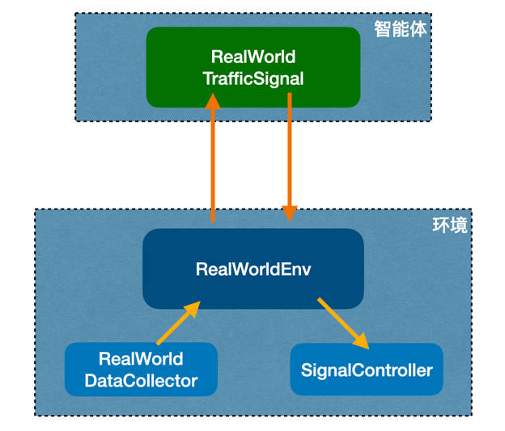

# AI实时信号控制系统

这个模块是使用训练后的模型对接交通信号控制器和雷视一体机控制交通信号的接口程序。

## 系统架构



如图所示，系统分为两部分：智能体和环境。

智能体就是“AI信号控制单元”，环境是指“交通信号控制机”和“雷视一体机”。智能体获取“环境状态”，进行决策，
输出“动作”给环境。环境状态是实时的路口交通状态，包括车流密度、排队长度和信号灯状态，
动作是“保持当前相位”或者“切换到下一相位”。

经过一个时间间隔后，智能体接受“环境状态”，输出“动作”给环境，继续循环。

## 智能体(RealWorldTrafficSignal)

智能体是本系统的核心模块，它加载训练后的算法模型，接受“状态”，输出“动作”。
智能体是跟路口形状紧密相关的。路口的几何形状，即路网模型（状态空间、动作空间、灯组配置）
是事先配置的静态信息。

逻辑如下：

``` 
env = createEnv(config)
model = createAgent(env,config)

observation = env.reset()

while True:
    action = model.predict(observation)
    observation,reward,dones,info = env.step(action)
    save_data(observation,reward,dones,info)

```

## 交通信号控制机(SignalController)

交通信号控制机是执行机构，它根据控制指令，维持或改变信号灯颜色。一个路口的有多少信号灯，
各信号灯控制什么车流，最小绿灯时间，最大绿灯时间，黄灯时间，一个路口有几个相位，
相位顺序等，都是预先配置的。

信号机接收智能体的发出的动作，或者维持当前的相位不变，或者切换到某个相位，即要么保持
当前灯色，要么改变为另一组灯色。

## 雷视一体机(RealWorldDataCollector)

雷视一体机是交通状态检测器，它检测路口的交通状态，发送给智能体。这些交通状态主要是
车流密度和排队长度。

