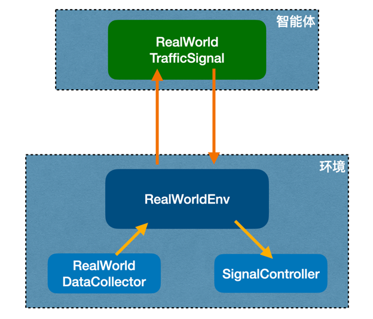

# 一，交通信号控制系统架构:

## 1. TrainingManager:

- 负责整个强化学习训练过程的管理
- 创建和配置环境(RealWorldEnv)
- 选择并创建强化学习算法(DQN, PPO, A2C, SAC等)
- 执行训练、评估和模型保存
- 处理观察空间的扁平化
- 记录训练过程中的奖励

在强化学习中,它扮演了"教练"的角色,负责整个训练流程。

## 2. TrafficControlSystem:

- 加载训练好的模型
- 运行实际的交通控制系统
- 从环境获取观察,使用模型预测动作,并将动作应用到环境中

在强化学习中,它代表了训练后的"智能体",负责实际控制交通信号。

## 3. RealWorldEnv:

- 实现了gym.Env接口,提供了强化学习所需的环境
- 管理多个交叉口(RealWorldTrafficSignal)  
- 处理动作空间(离散或连续)
- 计算奖励和观察
- 提供重置和步进功能

在强化学习中,它扮演了"环境"的角色,智能体与之交互来学习。

## 4. RealWorldTrafficSignal:

- 表示单个交叉口的交通信号
- 管理交通信号的状态(相位、时间等)
- 计算观察和奖励
- 执行动作(改变信号相位)

在强化学习中,它是环境的一个组成部分,代表智能体可以控制的对象。

## 5. RealWorldDataCollector:

- 收集和管理交叉口的实时数据(车辆数量、速度、密度等)
- 提供各种交通指标的计算方法

在强化学习中,它提供了计算观察和奖励所需的原始数据。

## 6. SignalController:

- 直接控制交通信号的底层接口
- 管理信号相位和定时

在强化学习中,它是环境的一部分,执行智能体选择的动作。

总的来说,这些组件共同构建了一个完整的强化学习系统用于交通信号控制:

- TrainingManager和TrafficControlSystem处理高层的训练和控制逻辑
- RealWorldEnv提供了强化学习所需的环境接口
- RealWorldTrafficSignal、RealWorldDataCollector和SignalController共同模拟和管理实际的交通系统

这种设计允许系统在模拟环境中训练,然后将训练好的模型应用到实际交通控制中。

## 7. test_real_world_env:

- 提供了一个测试脚本，验证环境的基本功能。
- 改进建议：添加更多的测试场景，包括边界条件和异常情况的处理。


## 8. 这些程序已经通过了本地测试，下一步考虑以下几个方向：

- 性能优化：分析程序的运行效率，特别是在处理大规模交通网络时的表现。
- 扩展功能：例如，添加对不同类型车辆的支持，或者实现更复杂的交通模式。
- 与强化学习算法集成：尝试使用不同的强化学习算法（如DQN、PPO等）来训练交通信号控制策略。
- 可视化：实现一个图形界面，实时显示交通状况和信号控制效果。
- 健壮性测试：模拟各种异常情况（如传感器故障、通信中断等），测试系统的应对能力。
- 真实数据集成：如果可能，尝试使用真实的交通数据来替换模拟数据，以验证系统在更接近真实世界的情况下的表现。
- 文档和注释：完善代码文档和注释，以便其他开发者能够更容易地理解和使用这个系统。



# 二，可视化设计方案

- 1，选择图形库：
    - 考虑到交通模拟的动态性质，Pygame 可能是一个好选择，因为它适合实时渲染和动画。
- 2，主要界面组件：
    - a. 交叉口视图：
        - 在屏幕中央显示交叉口的俯视图。
        - 使用不同颜色的矩形表示车道，绿色表示畅通，红色表示拥堵。
        - 使用小的矩形或圆形表示车辆。
        - 在交叉口中心显示当前的信号灯状态。
    - b. 信息面板：
        - 在屏幕右侧或底部显示关键信息。
        - 包括当前时间、每个车道的车辆数量、平均速度、队列长度等。
    - c. 控制面板：
        - 提供开始、暂停、重置模拟的按钮。
        - 允许调整模拟速度的滑块。
    - d. 图表区域：
        - 使用实时更新的折线图显示关键指标的变化趋势，如平均等待时间、总体流量等。

# 三，交通信号控制系统与强化学习算法集成

## 1. 设计思路
- a，环境接口标准化：
  - 确保RealWorldEnv类完全符合OpenAI Gym的接口标准。这包括reset()、step()、render()等方法。
  - 这样可以轻松地与各种强化学习库（如Stable Baselines3）集成。
- b，观察空间和动作空间定义：
  - 在RealWorldEnv中明确定义observation_space和action_space。
  - 确保这些空间与实际的交通信号控制问题相匹配。
- c，奖励函数设计：
  - 实现多种奖励函数，如基于等待时间、队列长度、平均速度等。
  - 允许用户选择或自定义奖励函数。
- d，训练接口：
  - 创建一个TrainingManager类，负责设置环境、选择算法、执行训练过程。
  - 支持多种强化学习算法，如DQN、PPO、A2C等。
- e，评估和测试：
  - 实现评估函数，用于测试训练后的模型性能。
  - 提供比较不同算法和参数设置的工具。
- f，模型保存和加载：
  - 允许保存训练好的模型，以便后续使用或继续训练。
  - 实现模型加载功能，用于部署或进一步优化。
- g，可视化训练过程：
  - 集成TensorBoard或其他可视化工具，展示训练过程中的奖励、损失等指标。
- h，多智能体支持：
  - 考虑扩展环境以支持多个交叉口的协同控制。
  - 实现适用于多智能体场景的算法。
- i，参数调优：
  - 提供超参数搜索功能，如网格搜索或贝叶斯优化。
- j，与现有系统的集成：
  - 设计接口，使训练好的模型可以轻松部署到实际的交通信号控制系统中。
- k，文档和示例：
  - 编写详细的文档，包括系统架构、使用说明和API参考。
  - 提供示例脚本，展示如何训练、评估和部署模型。

这个设计思路提供了一个全面的框架，用于将强化学习算法与交通信号控制系统集成。它涵盖了从环境定义到模型部署的整个过程，同时考虑了可扩展性、灵活性和易用性。

## 2. 设计完成并测试

- TrainingManager
- 支持DQN,PPO,A2C,SAC算法
- 修改了RealWorldEnv以兼容连续动作空间要求
- 经过test_real_world_env的测试。

# 四，开发TrafficControlSystem程序

使用预训练模型，控制交通信号。由于存在模型期望的观察空间和环境的真实观察空间的维度差异，11<22，程序临时调整了观察值以使程序正确运行。

解决办法：
- 在ubuntu上重新训练出一个DQN模型，保存模型参数；
- 在ubuntu上运行TrafficControlSystem，以测试是否还发生相同的问题。
- 注意adjust_observation的使用。

## 1.几个配置文件

### a. config-dqn-debug.txt

-   调试程序逻辑

```
{
    "env_params": {
        "intersection_ids": ["intersection_1"],
        "delta_time": 1,
        "yellow_time": 1,
        "min_green": 10,
        "max_green": 30,
        "num_seconds": 60,
        "reward_fn": "queue",
        "action_space_type": "discrete"
    },
    "algorithm": "PPO",
    "total_timesteps": 50000,
    "algo_params": {
        "learning_rate": 3e-4,
        "n_steps": 2048,
        "batch_size": 64,
        "n_epochs": 10,
        "gamma": 0.99,
        "gae_lambda": 0.95,
        "clip_range": 0.2,
        "clip_range_vf": null,
        "ent_coef": 0.01,
        "vf_coef": 0.5,
        "max_grad_norm": 0.5,
        "use_sde": false,
        "sde_sample_freq": -1,
        "target_kl": null,
        "tensorboard_log": "./ppo_traffic_single/",
        "policy_kwargs": {
            "net_arch": [{"pi": [128, 128], "vf": [128, 128]}],
            "activation_fn": "ReLU"
        },
        "verbose": 1
    }
}
```

### b. config-ppo-test.json

-   测试模型训练效果

```
{
    "env_params": {
        "intersection_ids": ["intersection_1"],
        "delta_time": 1,
        "yellow_time": 1,
        "min_green": 10,
        "max_green": 30,
        "num_seconds": 60,
        "reward_fn": "queue",
        "action_space_type": "discrete"
    },
    "algorithm": "PPO",
    "total_timesteps": 50000,
    "algo_params": {
        "learning_rate": 3e-4,
        "n_steps": 2048,
        "batch_size": 64,
        "n_epochs": 10,
        "gamma": 0.99,
        "gae_lambda": 0.95,
        "clip_range": 0.2,
        "clip_range_vf": null,
        "ent_coef": 0.01,
        "vf_coef": 0.5,
        "max_grad_norm": 0.5,
        "use_sde": false,
        "sde_sample_freq": -1,
        "target_kl": null,
        "tensorboard_log": "./ppo_traffic_single/",
        "policy_kwargs": {
            "net_arch": [{"pi": [128, 128], "vf": [128, 128]}],
            "activation_fn": "ReLU"
        },
        "verbose": 1
    }
}
```
### c. config-ppo-train.json
-   完整训练
```
{
    "env_params": {
        "intersection_ids": ["intersection_1", "intersection_2"],
        "delta_time": 5,
        "yellow_time": 2,
        "min_green": 10,
        "max_green": 50,
        "num_seconds": 3600,
        "reward_fn": "queue",
        "action_space_type": "discrete"
    },
    "algorithm": "PPO",
    "total_timesteps": 1000000,
    "algo_params": {
        "learning_rate": 3e-4,
        "n_steps": 2048,
        "batch_size": 64,
        "n_epochs": 10,
        "gamma": 0.99,
        "gae_lambda": 0.95,
        "clip_range": 0.2,
        "ent_coef": 0.01,
        "vf_coef": 0.5,
        "max_grad_norm": 0.5,
        "verbose": 1,
        "tensorboard_log": "./ppo_traffic_tensorboard/",
        "policy_kwargs": {
            "net_arch": [{"pi": [128, 128], "vf": [128, 128]}],
            "activation_fn": "torch.nn.Tanh"
        }
    },
    "model_path": "models",
    "evaluate_every": 50000,
    "save_every": 100000,
    "eval_episodes": 10
}
```

## 2. 三个配置文件的比较

表格中， "=" 表示两个配置中相同的项，使用具体的值表示不同的项。

| 类别 | 配置项 | config-ppo-test.json | config-ppo-train.json |
|------|--------|----------------------|------------------------|
| 环境参数 | intersection_ids | ["intersection_1"] | ["intersection_1", "intersection_2"] |
| | delta_time | 1 | 5 |
| | yellow_time | 1 | 2 |
| | min_green | 10 | = |
| | max_green | 30 | 50 |
| | num_seconds | 60 | 3600 |
| | reward_fn | "queue" | = |
| | action_space_type | "discrete" | = |
| 算法 | algorithm | "PPO" | = |
| 训练参数 | total_timesteps | 50000 | 1000000 |
| | learning_rate | 3e-4 | = |
| | n_steps | 2048 | = |
| | batch_size | 64 | = |
| | n_epochs | 10 | = |
| | gamma | 0.99 | = |
| | gae_lambda | 0.95 | = |
| | clip_range | 0.2 | = |
| | clip_range_vf | null | 未指定 |
| | ent_coef | 0.01 | = |
| | vf_coef | 0.5 | = |
| | max_grad_norm | 0.5 | = |
| | use_sde | false | 未指定 |
| | sde_sample_freq | -1 | 未指定 |
| | target_kl | null | 未指定 |
| | verbose | 1 | = |
| 网络结构 | policy_kwargs.net_arch | [{"pi": [128, 128], "vf": [128, 128]}] | = |
| | policy_kwargs.activation_fn | "ReLU" | "torch.nn.Tanh" |
| 日志和保存 | tensorboard_log | "./ppo_traffic_single/" | "./ppo_traffic_tensorboard/" |
| | model_path | 未指定 | "models" |
| | evaluate_every | 未指定 | 50000 |
| | save_every | 未指定 | 100000 |
| | eval_episodes | 未指定 | 10 |

这个表格全面展示了两个配置文件的所有项目，让我们可以清楚地看到它们之间的异同。主要的差异集中在环境参数、训练步数、激活函数以及额外的评估和保存功能上。相同的项目主要是 PPO 算法的核心参数，这表明两个配置在算法的基本设置上是一致的，主要区别在于应用场景和训练强度。

## 3. 定性分析

为了估算和比较这两种配置的训练时间，我们需要考虑几个关键因素：总训练步数、环境复杂度、和每步仿真时间。让我们逐一分析这些因素，然后给出一个粗略的估算。

1. 总训练步数:
   - config-ppo-test.json: 50,000 步
   - config-ppo-train.json: 1,000,000 步

   定量比较：train 配置的训练步数是 test 配置的 20 倍。

2. 环境复杂度:
   - config-ppo-test.json: 1 个交叉口
   - config-ppo-train.json: 2 个交叉口

   定性比较：train 配置的环境复杂度大约是 test 配置的 2 倍。

3. 每步仿真时间:
   - config-ppo-test.json: 60 秒
   - config-ppo-train.json: 3600 秒

   定量比较：train 配置的仿真时间是 test 配置的 60 倍。

4. 时间步长:
   - config-ppo-test.json: 1 秒
   - config-ppo-train.json: 5 秒

   定量比较：train 配置的时间步长是 test 配置的 5 倍，这意味着每次仿真需要处理的状态更新次数会减少。

估算训练时间：
假设在相同的硬件上运行，我们可以粗略估计 config-ppo-test.json 的训练时间为 T。

那么，config-ppo-train.json 的估计训练时间将是：
T * (20 * 2 * 60 / 5) = 480T

解释：
- 20 倍来自总训练步数的差异
- 2 倍来自环境复杂度的增加
- 60 倍来自每步仿真时间的增加
- 除以 5 是因为时间步长的增加，减少了每次仿真中的状态更新次数

**定性比较：**
1. 训练时长：train 配置的训练时间将显著长于 test 配置，可能需要几天时间，而 test 配置可能在几小时内完成。
2. 结果质量：train 配置由于训练时间更长、环境更复杂，很可能产生更好、更稳定、更具泛化能力的模型。
3. 资源消耗：train 配置将消耗更多的计算资源和能源。
4. 迭代速度：test 配置允许更快的实验迭代，有利于快速验证想法或调整超参数。

**定量估算：**
如果假设 config-ppo-test.json 的训练时间为 2 小时：
- config-ppo-test.json: 2 小时
- config-ppo-train.json: 2 * 480 = 960 小时 ≈ 40 天

实际情况可能会有所不同，因为：
1. 硬件优化可能会减少训练时间的差异。
2. 训练过程中的早停机制可能会缩短 train 配置的实际训练时间。
3. 更复杂的环境可能导致每步训练时间增加的比例大于线性关系。

**总结：**
虽然 config-ppo-train.json 的训练时间大大长于 config-ppo-test.json，但它提供了更全面的训练，可能产生更高质量的模型。选择使用哪种配置应该基于项目的具体需求、可用资源和时间限制来决定。
