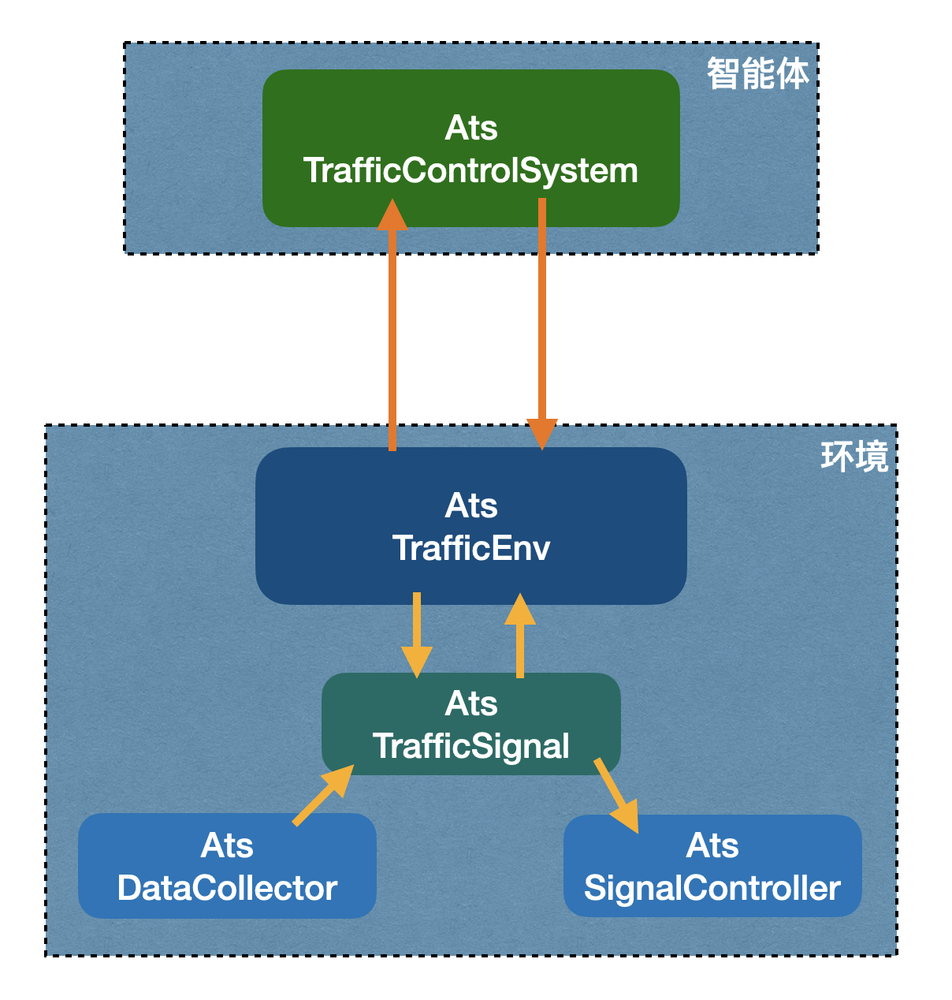

# ATS自动信号控制系统

本模块是AI自动控制系统的实现版本，是在aits基础上的更新与实现。
aits系统设计了系统架构，还包含有训练管理，特别是研究了rllib_resco的训练技术。

本模块不关注算法模型的训练技术，而是侧重于运用训练后的模型对真实的信号机进行控制。
系统的逻辑架构与aits完全相同，仍然是智能体与环境（信号机、检测器），但在实现细节
上解除了与SUMO的关联，增加了与真实环境的通信，即接收检测器的输入，输出信息给信号机。

## 主程序 ats_system.py (TrafficControlSystem)

主程序根据配置加载智能体（算法模型），智能体从环境中获得状态，根据状态输出动作给环境，环境执行一步动作，
再把执行结果传回到智能体，周而复始，循环运行这个过程。

主程序逻辑如下图所示。

## 交通环境 ats_traffic_env.py (AtsTrafficEnv)

- init: 
  - intersection_id
  - yellow_time
  - min_green
  - max_green
  - reward_fn
  - data_collectors
  - signal_controllers
  - traffic_signals
  - observation_space, 
  - action_space
- reset: 
  - traffic_signal.signal_controller.set_phase(0)
  - traffic_signal.data_collector.update()
  - observation=traffic_signal.compute_observation()
  - time & observation
- step(action):
  - traffic_signal.set_next_phase(action)
  - traffic_signal.update()
  - data_collector.update()
  - observation=traffic_signal.compute_observation()
  - reward=traffic_signal.compute_reward()
  - info=_compute_info()

### 交通信号 AtsTrafficSignal

- init: 
  - ts_id, yellow_time, min_green, max_green, 
  - reward_fn,
  - data_collector
  - signal_controller
  - phases
  - lanes, out_lanes, lanes_length
  - observation_space, action_space 
- set_next_phase(new_phase):
  - signal_controller.set_phase(new_phase)
- compute_observation:array(phase_id + min_green + density + queue)
  - phase_id
  - min_green
  - density
  - queue
- compute_reward:
  - reward_fn
  - queued
  - waiting_time
- time_to_act

### 状态检测器 AtsDataCollector

- init:
  - intersection_id
  - lanes
  - last_update_time
- update
  - _update_sensors
    - _update_vehicle_count
    - _update_vehicle_speed
  - update last_updage_time
- get_lane_vehicle_count
- get_lane_mean_speed
- get_lanes_density
- get_lanes_queue
- get_total_queued
- get_average_speed
- get_lane_queue

### 信号控制器 AtsSignalController

- init:
  - id
  - current_phase
  - last_change_time
  - phases=initial_phases:load from config file
- set_phase: send signal to hardware
- get_current_phase
- get_time_since_last_change
- get_phase_duration
- get_controlled_lanes
- get_controlled_links
- set_program
- set_phase_duration
- 