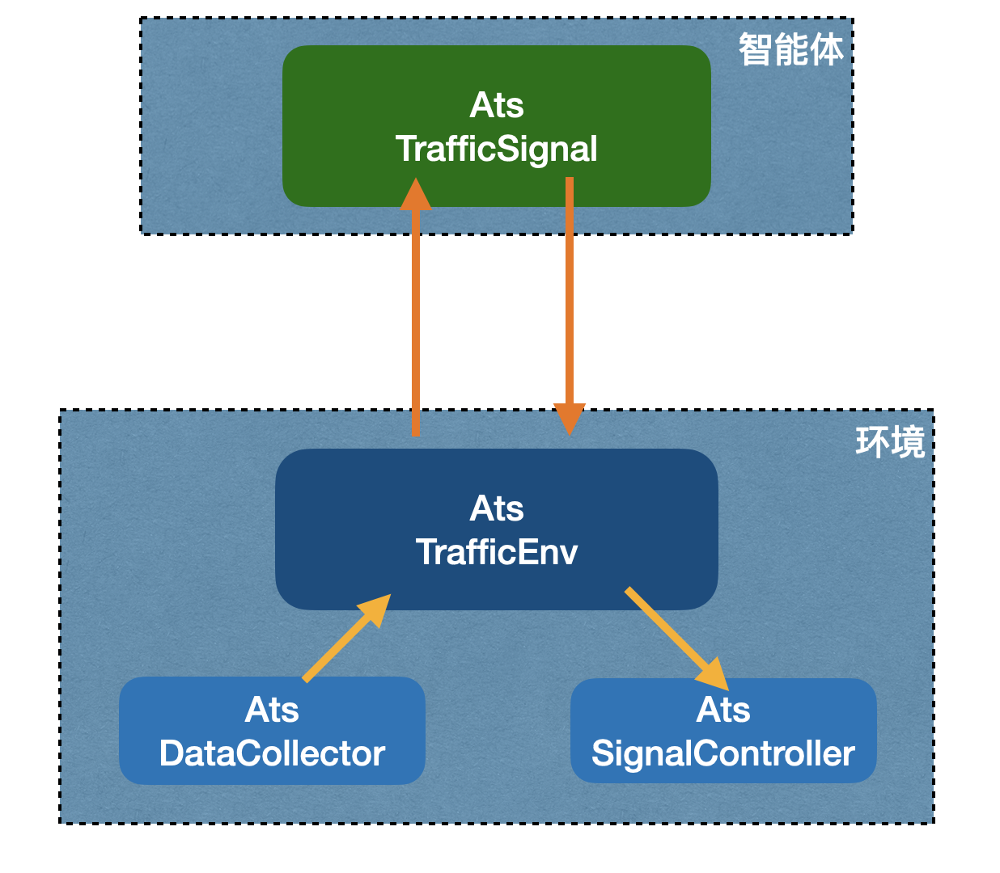
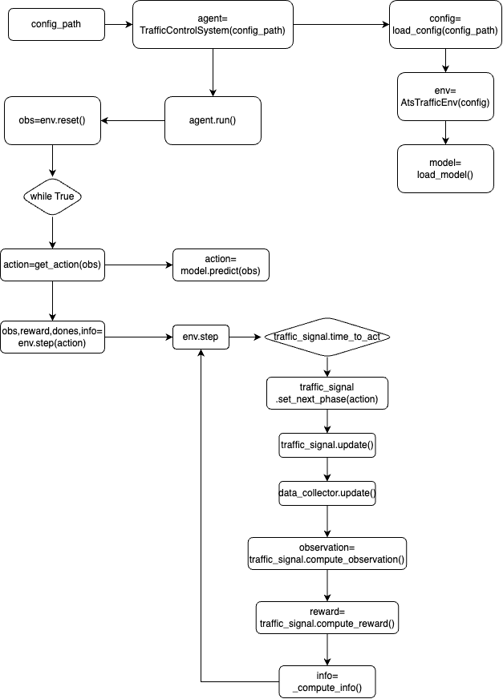

# ATS自动信号控制系统

本模块是AI自动控制系统的实现版本，是在aits基础上的更新与实现。
aits系统设计了系统架构，还包含有训练管理，特别是研究了rllib_resco的训练技术。

本模块不关注算法模型的训练技术，而是侧重于运用训练后的模型对真实的信号机进行控制。
系统的逻辑架构与aits完全相同，仍然是智能体与环境（信号机、检测器），但在实现细节
上解除了与SUMO的关联，增加了与真实环境的通信，即接收检测器的输入，输出信息给信号机。

## 主程序 ats_system.py (TrafficControlSystem)

智能体根据配置加载算法模块，从环境中获得状态，根据状态输出动作给环境，环境执行一步动作，
再把执行结果传回到智能体，周而复始，循环运行这个过程。

主程序逻辑如下图所示。

