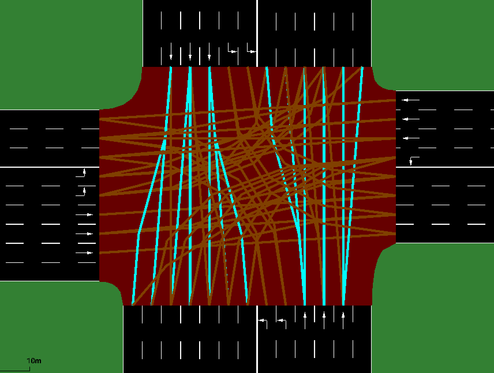

# 安庆市中山大道与中兴大道交叉口(zszx)-网络与流量

本模块是为了处理zszx的流量数据(data/input_data.txt)并对其进行分析的程序：
- 根据路口的几何形状设计路口网络zszx.net.xml:
  - 编写zszx.nod.xml
  - 编写zszx.edg.xml
  - 编写zszx.con.xml: 连接入口车道与出口车道，分配好连接方式，能解决拥堵及锁死问题，不要采用全连接，加再keepClear=True, sumo不能智能分配流量。
  - 编写zszx.tll.xml
  - 使用netconvert生成zszx.net.xml



```
all_phases:
0: 	40.0,	GGGGGGGGGGrrrrrrrrrrrrrrrrrGGGGGGGGGrrrrrrrrrrrrrrrrrrr
1: 	20.0,	rrrrrrrrrrGGGGrrrrrrrrrrrrrrrrrrrrrrGGGGrrrrrrrrrrrrrrr
2: 	50.0,	rrrrrrrrrrrrrrGGGGGGrrrrrrrrrrrrrrrrrrrrGGGGGGGrrrrrrrr
3: 	20.0,	rrrrrrrrrrrrrrrrrrrrGGGGGGGrrrrrrrrrrrrrrrrrrrrGGGGGGGG
4: 	3,	    yyyyyyyyyyrrrrrrrrrrrrrrrrryyyyyyyyyrrrrrrrrrrrrrrrrrrr
5: 	3,	    yyyyyyyyyyrrrrrrrrrrrrrrrrryyyyyyyyyrrrrrrrrrrrrrrrrrrr
6: 	3,	    yyyyyyyyyyrrrrrrrrrrrrrrrrryyyyyyyyyrrrrrrrrrrrrrrrrrrr
7: 	3,	    rrrrrrrrrryyyyrrrrrrrrrrrrrrrrrrrrrryyyyrrrrrrrrrrrrrrr
8: 	3,	    rrrrrrrrrryyyyrrrrrrrrrrrrrrrrrrrrrryyyyrrrrrrrrrrrrrrr
9: 	3,	    rrrrrrrrrryyyyrrrrrrrrrrrrrrrrrrrrrryyyyrrrrrrrrrrrrrrr
10: 3,	    rrrrrrrrrrrrrryyyyyyrrrrrrrrrrrrrrrrrrrryyyyyyyrrrrrrrr
11: 3,	    rrrrrrrrrrrrrryyyyyyrrrrrrrrrrrrrrrrrrrryyyyyyyrrrrrrrr
12: 3,	    rrrrrrrrrrrrrryyyyyyrrrrrrrrrrrrrrrrrrrryyyyyyyrrrrrrrr
13: 3,	    rrrrrrrrrrrrrrrrrrrryyyyyyyrrrrrrrrrrrrrrrrrrrryyyyyyyy
14: 3,	    rrrrrrrrrrrrrrrrrrrryyyyyyyrrrrrrrrrrrrrrrrrrrryyyyyyyy
15: 3,	    rrrrrrrrrrrrrrrrrrrryyyyyyyrrrrrrrrrrrrrrrrrrrryyyyyyyy 

origin phases:
0: 	40.0,	GGGGGGGGGGrrrrrrrrrrrrrrrrrGGGGGGGGGrrrrrrrrrrrrrrrrrrr
1: 	3,	    yyyyyyyyyyrrrrrrrrrrrrrrrrryyyyyyyyyrrrrrrrrrrrrrrrrrrr
2: 	20.0,	rrrrrrrrrrGGGGrrrrrrrrrrrrrrrrrrrrrrGGGGrrrrrrrrrrrrrrr
3: 	3,	    rrrrrrrrrryyyyrrrrrrrrrrrrrrrrrrrrrryyyyrrrrrrrrrrrrrrr
4: 	50.0,	rrrrrrrrrrrrrrGGGGGGrrrrrrrrrrrrrrrrrrrrGGGGGGGrrrrrrrr
5:  3,	    rrrrrrrrrrrrrryyyyyyrrrrrrrrrrrrrrrrrrrryyyyyyyrrrrrrrr
6: 	20.0,	rrrrrrrrrrrrrrrrrrrrGGGGGGGrrrrrrrrrrrrrrrrrrrrGGGGGGGG
7:  3,	    rrrrrrrrrrrrrrrrrrrryyyyyyyrrrrrrrrrrrrrrrrrrrryyyyyyyy

yellow_dict:
 {
 (0, 1): 4, 
 (0, 2): 5, 
 (0, 3): 6, 
 (1, 0): 7, 
 (1, 2): 8, 
 (1, 3): 9, 
 (2, 0): 10, 
 (2, 1): 11, 
 (2, 3): 12, 
 (3, 0): 13, 
 (3, 1): 14, 
 (3, 2): 15
 }
 
```

  ```
  netconvert --node-files=zszx.nod.xml \
           --edge-files=zszx.edg.xml \
           --connection-files=zszx.con.xml \
           --tllogic-files=zszx.tll.xml \
           --output-file=zszx.net.xml \
           --ignore-errors
  
  netconvert --node-files=zszx.nod.xml \
           --edge-files=zszx.edg.xml \
           --connection-files=zszx-1.con.xml \
           --tllogic-files=zszx-1.tll.xml \
           --output-file=zszx-1.net.xml \
           --ignore-errors
           
  netconvert --node-files=zszx.nod.xml \
           --edge-files=zszx.edg.xml \
           --connection-files=zszx-2.con.xml \
           --tllogic-files=zszx-2.tll.xml \
           --output-file=zszx-2.net.xml \
           --ignore-errors
  ```
- 对历史流量数据进行预处理，使其满足SUMO仿真系统的数据规范(data/output_data.txt):data_process.py
- 统计分析历史数据，得到按时间（小时）、按方向的流量数据（下表）以及曲线图(下图):flow_analysis.py
- 使用kmeans聚类方法，对一天24小时的流量划分时段:flow-kmeans.py
- 按照不同时段、不同方向的流量数据编写分时段的交通需求
- 由于SUMO的流量配置只能是静态数据，不能在仿真过程中切换，所以方向流量配置只能取一个时段的，如zszx-perhour.rou.xml
- 对于路口信号配时方案，若能满足高峰时刻的交通需求，则对于平峰时段的需求必定能满足，因此，在训练过程中，只需要用高峰时段的流量进行训练
- 对方向平均流量进行上下浮动，设计交通需求，供智能体训练
- 是否可以在训练过程中，使用traci接口在训练过程中实时生成该时段的车流量呢？
  这是肯定能行的，traci-load.py程序就实现了动太生成车辆的需求。
  但是，按上面的分析，配时方案能满大流量时，必定能满足小流量，那么，只需要训练高流量方案就可以了。
- data_process.py 生成了按日/小时/分钟-方向的车流数据：
  - traffic_flow_daily.csv / traffic_flow_daily.png
  - traffic_flow_hourly.csv
  - traffic_flow_minute.csv


方向/小时交通流量的变化图：


方向/小时交通流量的变化表：

| hour | ES  | EW  | NE  | NS  | SN  | SW  | WE  | WN  |
|------|-----|-----|-----|-----|-----|-----|-----|-----|
| 0    | 21  | 37  | 2   | 66  | 69  | 75  | 89  | 12  |
| 1    | 7   | 30  | 2   | 44  | 52  | 49  | 45  | 11  |
| 2    | 2   | 31  | 4   | 37  | 51  | 30  | 39  | 10  |
| 3    | 8   | 25  | 4   | 73  | 58  | 37  | 51  | 9   |
| 4    | 5   | 37  | 8   | 91  | 73  | 41  | 57  | 12  |
| 5    | 24  | 105 | 9   | 166 | 125 | 108 | 173 | 38  |
| 6    | 70  | 305 | 33  | 301 | 350 | 436 | 374 | 131 |
| 7    | 223 | 770 | 89  | 508 | 1028| 1308| 1118| 252 |
| 8    | 207 | 760 | 137 | 793 | 1561| 1153| 1123| 469 |
| 9    | 220 | 775 | 146 | 910 | 1030| 837 | 1118| 512 |
| 10   | 239 | 663 | 139 | 922 | 866 | 746 | 1169| 462 |
| 11   | 275 | 633 | 137 | 1004| 750 | 588 | 1283| 435 |
| 12   | 192 | 546 | 114 | 788 | 740 | 467 | 1030| 321 |
| 13   | 210 | 621 | 118 | 884 | 840 | 763 | 1053| 399 |
| 14   | 194 | 659 | 135 | 964 | 825 | 892 | 1195| 430 |
| 15   | 230 | 616 | 141 | 1019| 803 | 714 | 1395| 404 |
| 16   | 306 | 567 | 142 | 1002| 800 | 586 | 1633| 411 |
| 17   | 611 | 536 | 172 | 1192| 638 | 672 | 2383| 377 |
| 18   | 252 | 340 | 87  | 677 | 397 | 616 | 1199| 149 |
| 19   | 103 | 236 | 54  | 382 | 243 | 448 | 625 | 99  |
| 20   | 81  | 159 | 43  | 223 | 298 | 454 | 544 | 55  |
| 21   | 46  | 122 | 37  | 150 | 184 | 329 | 387 | 42  |
| 22   | 38  | 83  | 12  | 94  | 100 | 170 | 215 | 26  |
| 23   | 29  | 54  | 4   | 69  | 107 | 102 | 121 | 9   |

方向/小时流量分段图


**得到的分时段分方向交通流量**

```
Time periods based on change points:
night_peak: 0 - 6
morning_peak: 6 - 7
day_flat: 7 - 17
evening_peak: 17 - 18
evening_flat: 18 - 19
night_flat: 19 - 24

Calculated vehicle generation rates per time period:
time_periods_flow = {
    'night_peak': {'ES': 1.12, 'EW': 4.42, 'NE': 0.48, 'NS': 7.95, 'SN': 7.13, 'SW': 5.67, 'WE': 7.57, 'WN': 1.53},
    'morning_peak': {'ES': 1.17, 'EW': 5.08, 'NE': 0.55, 'NS': 5.02, 'SN': 5.83, 'SW': 7.27, 'WE': 6.23, 'WN': 2.18},
    'day_flat': {'ES': 38.27, 'EW': 110.17, 'NE': 21.63, 'NS': 146.57, 'SN': 154.05, 'SW': 134.23, 'WE': 201.95, 'WN': 68.25},
    'evening_peak': {'ES': 10.18, 'EW': 8.93, 'NE': 2.87, 'NS': 19.87, 'SN': 10.63, 'SW': 11.2, 'WE': 39.72, 'WN': 6.28},
    'evening_flat': {'ES': 4.2, 'EW': 5.67, 'NE': 1.45, 'NS': 11.28, 'SN': 6.62, 'SW': 10.27, 'WE': 19.98, 'WN': 2.48},
    'night_flat': {'ES': 4.95, 'EW': 10.9, 'NE': 2.5, 'NS': 15.3, 'SN': 15.53, 'SW': 25.05, 'WE': 31.53, 'WN': 3.85}
}
```

**按日期分方向平均流量表**

| 日期         | 方向 | 日流量 | 小时流量 | 小时流量*1.5 | 小时流量*2 |
|------------|----|--------|----------|----------|------------|
| 2024-10-20 | NS | 5999   | 249      | 333      | 499        |
| 2024-10-20 | NE | 860    | 35       | 47       | 71         |
| 2024-10-20 | EW | 4275   | 178      | 237      | 356        |
| 2024-10-20 | ES | 1590   | 66       | 88       | 132        |
| 2024-10-20 | SN | 5723   | 238      | 317      | 476        |
| 2024-10-20 | SW | 6108   | 254      | 339      | 509        |
| 2024-10-20 | WE | 9211   | 383      | 511      | 767        |
| 2024-10-20 | WN | 2389   | 99       | 132      | 199        |
| 2024-10-21 | NS | 6360   | 265      | 353      | 530        |
| 2024-10-21 | NE | 909    | 37       | 50       | 75         |
| 2024-10-21 | EW | 4435   | 184      | 246      | 369        |
| 2024-10-21 | ES | 2003   | 83       | 111      | 166        |
| 2024-10-21 | SN | 6265   | 261      | 348      | 522        |
| 2024-10-21 | SW | 5513   | 229      | 306      | 459        |
| 2024-10-21 | WE | 9208   | 383      | 511      | 767        |
| 2024-10-21 | WN | 2686   | 111      | 149      | 223        |

按日各方向平均流量图


**根据上述数据（转化为小时平均 /24），编写需求文件zszx-perhour.rou.xml**

```
    <!-- 大流量方案 -->
    <!-- 北进口  -->
    <flow id="flow_ns" route="NS" begin="0" end="86400" vehsPerHour="499" departSpeed="max" departPos="base" departLane="best"/>
    <flow id="flow_ne" route="NE" begin="0" end="86400" vehsPerHour="71" departSpeed="max" departPos="base" departLane="best"/>

    <!-- 东进口  -->
    <flow id="flow_ew" route="EW" begin="0" end="86400" vehsPerHour="356" departSpeed="max" departPos="base" departLane="best"/>
    <flow id="flow_es" route="ES" begin="0" end="86400" vehsPerHour="132" departSpeed="max" departPos="base" departLane="best"/>

    <!-- 南进口  -->
    <flow id="flow_sn" route="SN" begin="0" end="86400" vehsPerHour="476" departSpeed="max" departPos="base" departLane="best"/>
    <flow id="flow_sw" route="SW" begin="0" end="86400" vehsPerHour="509" departSpeed="max" departPos="base" departLane="best"/>

    <!-- 西进口  -->
    <flow id="flow_we" route="WE" begin="0" end="86400" vehsPerHour="767" departSpeed="max" departPos="base" departLane="best"/>
    <flow id="flow_wn" route="WN" begin="0" end="86400" vehsPerHour="199" departSpeed="max" departPos="base" departLane="best"/>

```

```
    <!-- 中流量方案 -->
    <!-- 北进口  -->
    <flow id="flow_ns" route="NS" begin="0" end="86400" vehsPerHour="333" departSpeed="max" departPos="base" departLane="best"/>
    <flow id="flow_ne" route="NE" begin="0" end="86400" vehsPerHour="47" departSpeed="max" departPos="base" departLane="best"/>

    <!-- 东进口  -->
    <flow id="flow_ew" route="EW" begin="0" end="86400" vehsPerHour="237" departSpeed="max" departPos="base" departLane="best"/>
    <flow id="flow_es" route="ES" begin="0" end="86400" vehsPerHour="88" departSpeed="max" departPos="base" departLane="best"/>

    <!-- 南进口  -->
    <flow id="flow_sn" route="SN" begin="0" end="86400" vehsPerHour="317" departSpeed="max" departPos="base" departLane="best"/>
    <flow id="flow_sw" route="SW" begin="0" end="86400" vehsPerHour="339" departSpeed="max" departPos="base" departLane="best"/>

    <!-- 西进口  -->
    <flow id="flow_we" route="WE" begin="0" end="86400" vehsPerHour="511" departSpeed="max" departPos="base" departLane="best"/>
    <flow id="flow_wn" route="WN" begin="0" end="86400" vehsPerHour="132" departSpeed="max" departPos="base" departLane="best"/>

```

```
    <!-- 小流量方案 -->
    <!-- 北进口  -->
    <flow id="flow_ns" route="NS" begin="0" end="86400" vehsPerHour="249" departSpeed="max" departPos="base" departLane="best"/>
    <flow id="flow_ne" route="NE" begin="0" end="86400" vehsPerHour="35" departSpeed="max" departPos="base" departLane="best"/>

    <!-- 东进口  -->
    <flow id="flow_ew" route="EW" begin="0" end="86400" vehsPerHour="178" departSpeed="max" departPos="base" departLane="best"/>
    <flow id="flow_es" route="ES" begin="0" end="86400" vehsPerHour="66" departSpeed="max" departPos="base" departLane="best"/>

    <!-- 南进口  -->
    <flow id="flow_sn" route="SN" begin="0" end="86400" vehsPerHour="238" departSpeed="max" departPos="base" departLane="best"/>
    <flow id="flow_sw" route="SW" begin="0" end="86400" vehsPerHour="254" departSpeed="max" departPos="base" departLane="best"/>

    <!-- 西进口  -->
    <flow id="flow_we" route="WE" begin="0" end="86400" vehsPerHour="383" departSpeed="max" departPos="base" departLane="best"/>
    <flow id="flow_wn" route="WN" begin="0" end="86400" vehsPerHour="99" departSpeed="max" departPos="base" departLane="best"/>

```

```
<routes>
    <vType accel="1.0" decel="4.5" id="standard_car" length="5.0" minGap="2.5" maxSpeed="30" sigma="0.5" />
    <route id="WN" edges="w_t t_n"/>
    <route id="WE" edges="w_t t_e"/>
    <route id="WS" edges="w_t t_s"/>

    <route id="NW" edges="n_t t_w"/>
    <route id="NE" edges="n_t t_e"/>
    <route id="NS" edges="n_t t_s"/>

    <route id="EW" edges="e_t t_w"/>
    <route id="EN" edges="e_t t_n"/>
    <route id="ES" edges="e_t t_s"/>

    <route id="SW" edges="s_t t_w"/>
    <route id="SN" edges="s_t t_n"/>
    <route id="SE" edges="s_t t_e"/>

    <!-- 流量方案 -->
</routes>
```

## 关于观察空间与观察实例

### 读程序observations.py

1. 首先定义了一个抽象基类 `ObservationFunction`，它有两个抽象方法需要子类实现:
   - `__call__()`: 用于获取观察值
   - `observation_space()`: 用于定义观察空间

2. `DefaultObservationFunction` 是具体实现类，它的观察向量包含以下几部分:

   ```
   # 信号灯当前相位的独热编码
   phase_id = [1 if self.ts.green_phase == i else 0 for i in range(self.ts.num_green_phases)]
   
   # 最小绿灯时间是否已满足(0或1)
   min_green = [0 if self.ts.time_since_last_phase_change < self.ts.min_green + self.ts.yellow_time else 1]
   
   # 车道密度
   density = self.ts.get_lanes_density()
   
   # 车道排队长度
   queue = self.ts.get_lanes_queue()
   ```

3. 最终的观察向量是这些部分的拼接:
   - 相位独热编码(num_green_phases维)
   - 最小绿灯时间标志(1维) 
   - 车道密度(lanes数量维)
   - 排队长度(lanes数量维)

4. `observation_space()` 定义了观察空间:
   - 使用 `gymnasium.spaces.Box` 
   - 维度是 num_green_phases + 1 + 2 * len(lanes)
   - 所有值都在[0,1]范围内

这个观察函数的设计体现了交通信号控制中的关键特征:
- 当前信号相位状态
- 时序约束(最小绿灯时间)
- 交通状态(密度和排队长度)

### 观察路口网络图

从路口网络图看出，北进口有4直行车道2左转车道，东进口有3直行车道1左转车道，南进口有4直行车道2左转车道，西进口有4直行车道2左转车道。
如果将最右边的车道作为右转专用车道（东进口除外），则可以设计：

抱歉之前理解有误。让我重新设计，考虑东进口不设右转专用车道的情况：

1. 灯控车道统计：
- 北进口：3直行 + 2左转 = 5车道（去掉右转专用）
- 东进口：3直行 + 1左转 = 4车道（保持原样）
- 南进口：3直行 + 2左转 = 5车道（去掉右转专用）
- 西进口：3直行 + 2左转 = 5车道（去掉右转专用）

总计：len(lanes) = 19车道

2. 相位设计：
- Phase 1: 东西直行相位
- Phase 2: 东西左转相位
- Phase 3: 南北直行相位  
- Phase 4: 南北左转相位

所以 num_green_phases = 4

3. 观察空间及维度：
```
维度 = num_green_phases + 1 + 2 * len(lanes)
    = 4 + 1 + 2 * 19
    = 43 维
```
observation_space=shape(43,)

4. 观察向量实例：
```python
[
    # 相位独热编码 (4维)
    1, 0, 0, 0,  # 假设当前是东西直行相位
    
    # 最小绿灯时间标志 (1维)
    1,  # 假设已满足最小绿灯时间
    
    # 车道密度 (19维，范围0-1)
    # 北进口5个车道
    0.6, 0.5, 0.4,  # 3个直行车道
    0.3, 0.3,  # 2个左转车道
    
    # 东进口4个车道
    0.4, 0.4, 0.3,  # 3个直行车道
    0.5,  # 1个左转车道
    
    # 南进口5个车道
    0.5, 0.6, 0.4,  # 3个直行车道
    0.4, 0.3,  # 2个左转车道
    
    # 西进口5个车道
    0.6, 0.5, 0.4,  # 3个直行车道
    0.4, 0.3,  # 2个左转车道
    
    # 车道排队长度 (19维，范围0-1)
    # 北进口5个车道
    0.7, 0.6, 0.5,  # 3个直行车道
    0.4, 0.4,  # 2个左转车道
    
    # 东进口4个车道
    0.5, 0.5, 0.4,  # 3个直行车道
    0.6,  # 1个左转车道
    
    # 南进口5个车道
    0.6, 0.7, 0.5,  # 3个直行车道
    0.5, 0.4,  # 2个左转车道
    
    # 西进口5个车道
    0.7, 0.6, 0.5,  # 3个直行车道
    0.5, 0.4   # 2个左转车道
]
```
